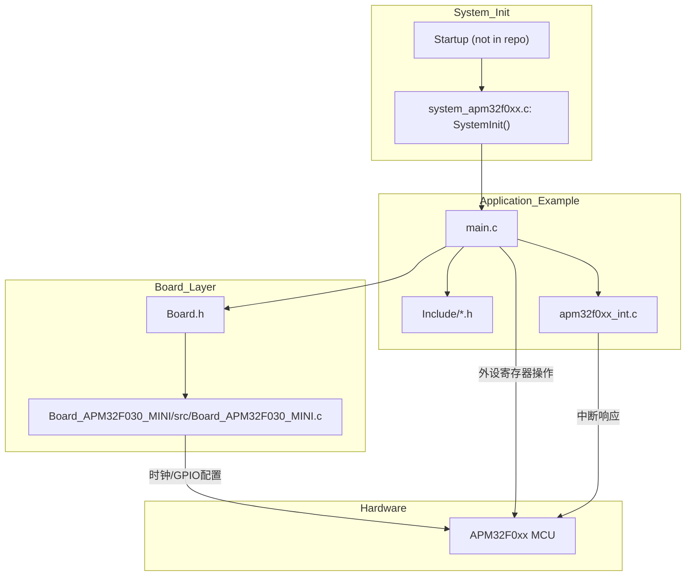
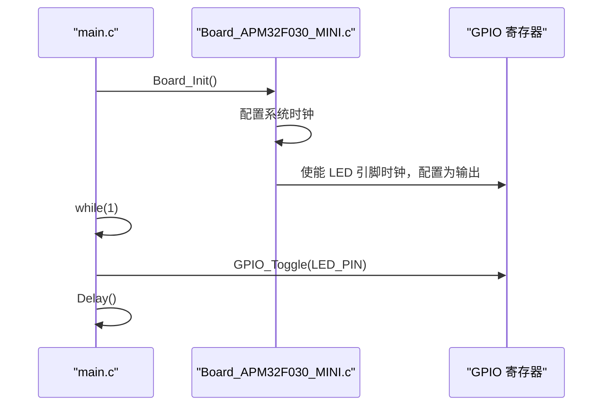
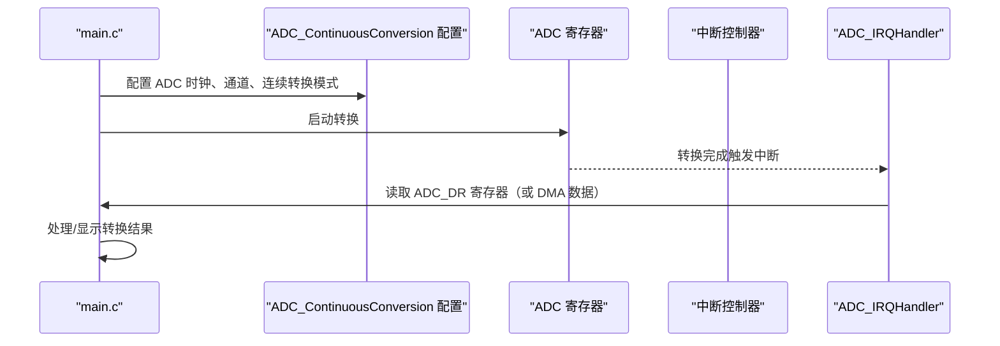
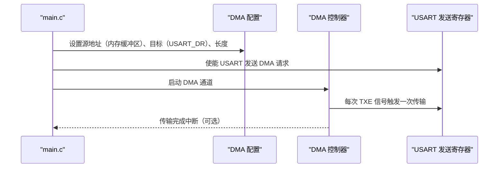

# 项目框架分析报告

## 1. 技术栈分析

**推断依据**

| 维度 | 信息 |
|---|---|
| **主语言** | C（所有源文件与头文件均为 `.c`/`.h`） |
| **目标平台** | 极海半导体 APM32F0xx 系列（ARM Cortex-M0+），从 `Boards/` 目录下的多种 Mini 板与 `Examples/` 中外设命名可见 |
| **固件库** | APM32F0xx SDK（库文件本身未出现在本仓库内，但每个示例都依赖 `system_apm32f0xx.c/h`、`apm32f0xx_int.c/h` 等标准外设库封装） |
| **构建系统** | 三套 IDE 工程：<br/> • Eclipse CDT + GCC ARM Embedded（含 `.cproject`、`.project`、`gcc_*.ld` 链接脚本）<br/> • IAR EWARM（`.ewp`、`.eww`）<br/> • Keil MDK-ARM（`.uvprojx`） |
| **调试接口** | 通过所选 IDE 内置的调试器驱动（J-Link / CMSIS-DAP / ST-Link 等，未在仓库中直接体现） |

**不确定项**  
- 仓库是否包含完整的 SDK 源码（如外设驱动 `apm32f0xx_ppp.c`）不存在于当前目录树中，可能以库形式预编译或被外部依赖引用。

---

## 2. 架构与数据流

### 目录分层

```
.
├── Boards/          # 板级支持包（BSP），为每款开发板提供公共初始化
│   ├── Board.h / Board.c
│   └── Board_<型号>/  (inc/ + src/)
├── Documents/       # 芯片数据手册、SDK 用户手册
└── Examples/        # 外设示例（每个示例一个独立迷你工程）
    └── <外设>/
        └── <演示名>/
            ├── Include/   # 应用头文件
            ├── Source/    # main.c + 中断服务表 + system_xxx.c
            ├── Project/   # Eclipse / IAR / MDK 工程文件
            └── readme.txt
```

### 请求/任务数据流

系统是裸机/简单 RTOS 架构，没有复杂分层。数据流为：  
**上电 → 启动文件（`startup_*.s`，未在本仓库出现） → `system_apm32f0xx.c: SystemInit()` 时钟初始化 → `main()` → 配置外设 → 使用中断/DMA/轮询方式处理数据。**



---

## 3. 关键模块与事件分析

### 场景一：GPIO 翻转（最简入口）

**说明**：新人最常见的上手点，演示 LED 闪烁。  
**参与者**：用户 main 函数、Board 初始化、GPIO 外设。



### 场景二：ADC 连续转换

**说明**：展示外设初始化和数据读取流程（以 `ADC_ContinuousConversion` 为例）。  
**参与者**：main、ADC 驱动、中断控制器。



### 场景三：DMA 与 USART 配合

**说明**：展示 DMA 如何自动搬运数据到 USART 发送寄存器（`DMA_Usart` 示例）。  
**参与者**：main、DMA 控制器、USART 外设。



---

## 4. 快速上手路线

### 一天学习路径（约 8 小时）

| 时间 | 任务 | 详细说明 |
|------|------|----------|
| **0－1h** | 环境准备 | Clone 仓库；安装 Keil MDK‑ARM（推荐）或 IAR，确认已安装 APM32F0xx 器件包。阅读 `Documents/DATASHEET.pdf` 了解芯片基本特性。 |
| **1－3h** | 运行首个示例 | 打开 `Examples/GPIO/GPIO_Toggle/Project/MDK/GPIO_Toggle.uvprojx`，编译、下载到对应 Mini 板（如 `APM32F030_MINI`），观察 LED 闪烁，确认工具链正常。 |
| **3－5h** | 理解 Board 层 | 阅读 `Boards/Board.h` 及所用开发板的 `Board_*.c`（例如 `Board_APM32F030_MINI.c`），弄清 `Board_Init()` 做了哪些时钟和外设初始化。修改 LED 翻转频率，验证理解。 |
| **5－7h** | 外设实战 | 打开 `Examples/ADC/ADC_ContinuousConversion/`，编译运行，用调试器观察 ADC 转换值。尝试将结果通过 `printf` 重定向到 UART（可参考 `Examples/SPI/` 或 `DMA/` 中的串口使用）。 |
| **7－8h** | 进阶了解 | 浏览 `Examples/IAP/IAP_BootLoader/` 的 `readme.txt` 及代码，理解 Bootloader 与 APP 分区跳转机制；若有兴趣可尝试 RTOS 示例（`Examples/RTOS/FreeRTOS/` 或 `RT-Thread`）。 |

### 必读文件/目录
- `Boards/Board.h`
- 你所使用开发板对应的 `Board_<型号>/inc/Board_<型号>.h` 及 `src/Board_<型号>.c`
- `Examples/GPIO/GPIO_Toggle/` （最小化示例）
- `Examples/ADC/ADC_ContinuousConversion/` （外设模板）
- `Documents/APM32F0xx_SDK_um.chm` （外设库函数说明）

### 建议调试断点 / 日志位置
- 在 `main()` 入口设断，观察初始化顺序
- 在 `apm32f0xx_int.c` 中的 `HardFault_Handler` 等异常处理函数内设断点，便于排查内存错误
- 利用串口重定向 `printf`（需自行实现 `__io_putchar` 或类似函数）输出运行时信息；若未实现，可先通过 LED 闪烁次数传递简单状态。

### 常见坑
- **链接脚本选择**：不同型号芯片的 Flash/RAM 大小不同，务必在 IDE 工程中选择正确的 `gcc_*.ld` 或 Keil 目标器件。
- **时钟配置**：若更换开发板，须保证 `Board_*.c` 中的晶振频率（HSE_VALUE）与实际硬件一致，否则定时器、UART 波特率均会出错。
- **缺少 SDK 库文件**：若直接移植示例到完全空的工程，需将厂商提供的标准外设库源文件（如 `apm32f0xx_gpio.c`）添加到工程，否则链接时会报 undefined symbol。本仓库中示例仅包含 `system_apm32f0xx.c` 和中断服务文件，因此完整 SDK 库需从其它位置获取。